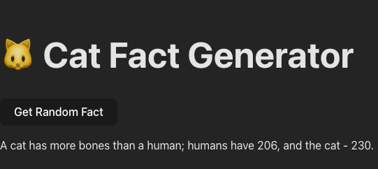

# 🐱 Cat Fact Generator – React + Vite + Tailwind CSS

A simple web app that fetches a random cat fact using a public API and displays it on the screen. Built using **React**, **Vite**, and **Tailwind CSS**.

---

## 🚀 Features

- ✅ One-click random fact fetch
- ✅ Uses async/await and fetch API
- ✅ Clean, responsive UI with Tailwind CSS
- ✅ Error handling included

---

## 📷 Preview

 -->

---

## 🔧 Tech Stack

- [React](https://reactjs.org/)
- [Vite](https://vitejs.dev/)
- [Tailwind CSS](https://tailwindcss.com/)
- [catfact.ninja API](https://catfact.ninja)

---

## 📦 Setup Instructions

### 1. Clone the repo

```bash
git clone https://github.com/your-username/cat-fact-app.git
cd cat-fact-app


2. Install dependencies
npm install


3. Run the development server

npm run dev
Visit http://localhost:5173 to view the app.

📡 API Used
Endpoint: https://catfact.ninja/fact

Method: GET

Returns a random cat fact in JSON format.

🧑‍💻 Author
Mamta Vyas